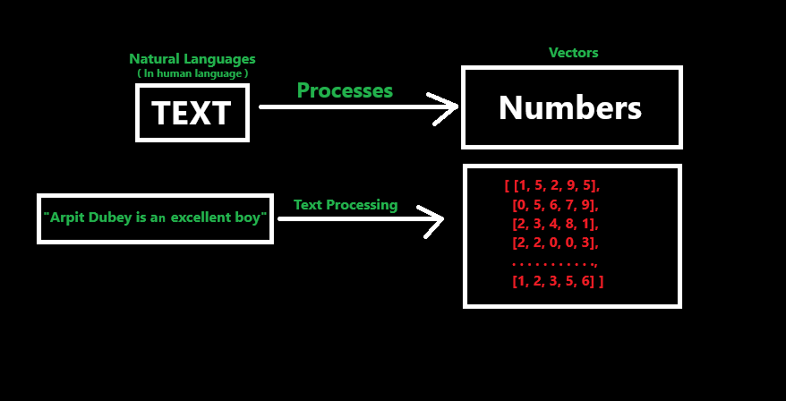

# Introduction to NLP (Natural Language Process)

- Natural language Processing (NLP) is a **subfield** of **Artificial Intelligence** that focuses on the **interaction** between computers and humans through **natural language**.
- Natural languages are those **spoken and understand by humans** like English, Hindi, Sanskrit, Tamil, Telugu, French, German, Spanish etc.,
- Natural Language Processing is a **way or set of processes** by which these natural languages can be **converted into numerical set of vectors** by which a computer or machine can able to understand it.

- NLP's applications ranges from chatbots and language translation to sentiment analysis and content generation.

### What is NLP

- It encompasses the **computational** techniques that enables machines to understand, interpret, and generate human language.
- It combines **linguistics,** computer science, and **machine learning** to facilitate human-computer interaction.
